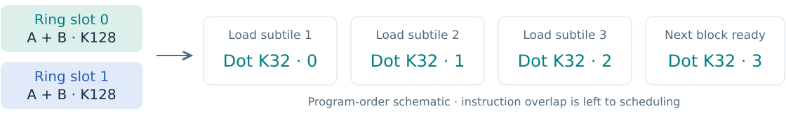
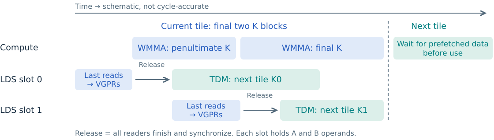
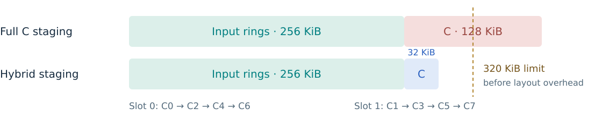
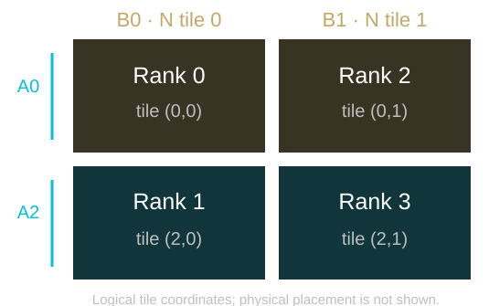

<!-- _class: divider title -->

# Programming CDNA5 / gfx1250

<p class="subtitle">Ivan Butygin, 2026</p>

<!--
10 sec. Introduce yourself and the topic, then move to the hardware overview.
-->

---

<!-- _class: compact -->

<div class="eyebrow">02 / Architecture · Programming CDNA5 / gfx1250</div>

# Hardware overview

| | CDNA3 · gfx942 | CDNA4 · gfx950 | CDNA5 · gfx1250 |
| :--- | :--- | :--- | :--- |
| Wave size | Wave64 | Wave64 | **Wave32** |
| LDS capacity | 64 KiB / CU | 160 KiB / CU | **320 KiB / WGP** |
| Matrix instructions | MFMA | MFMA | **WMMA** |
| Matrix registers | VGPR + AGPR | VGPR + AGPR | **One VGPR namespace** |


> Larger tiles fit. Keeping the matrix units supplied is the next problem.

<div class="source">CDNA5 ISA §§1.1, 2.2, 3.4.9 · CDNA4 whitepaper, p. 9 · CDNA5 whitepaper, pp. 6–10 · LDS units as labeled.</div>

<!--
2 min 50 sec. Introduce wave size, workgroup placement, memory capacity, and matrix instructions.
CDNA5: one WGP contains two CUs, each with two SIMD32s. CU remains a subunit of the WGP.
All waves of one workgroup run within one WGP and may use any of its four SIMD32s and shared LDS.
Use WGP for CDNA5 workgroup placement and the 320 KiB LDS budget; use CU for its two-SIMD subunits.
The CDNA4-to-CDNA5 capacity comparison is 160 KiB per CDNA4 CU versus 320 KiB per CDNA5 WGP.
Wave size and hardware grouping are separate properties; this is not a claim of doubled LDS per CU.
Capacity and bandwidth are separate properties. Larger working sets can reduce resident waves.
Source: CDNA5 ISA, 27 July 2026, §§1.1, 2.2, 3.4.9.
Sources: https://www.amd.com/content/dam/amd/en/documents/instinct-tech-docs/white-papers/amd-cdna-4-architecture-whitepaper.pdf
https://www.amd.com/content/dam/amd/en/documents/products/technologies/cdna/amd-cdna5-whitepaper.pdf
-->

---

<!-- _class: asm-detail registers-asm -->

<div class="eyebrow">03 / Registers and matrix programming</div>

# More addressable VGPRs for one wave

- Up to **1024 VGPRs per thread**.
- `S_SET_VGPR_MSB` supplies index bits 9:8 for each operand class.
- Low index 7 + MSB value 2 selects **v519**; settings persist.

<div class="registers">
<div>MSB 0<br>v0–v255</div>
<div>MSB 1<br>v256–v511</div>
<div class="selected">MSB 2<br>v512–v767</div>
<div>MSB 3<br>v768–v1023</div>
</div>

<p class="small muted">Generated matrix-instruction excerpt · FP16 A/B → FP32 accumulator</p>

```asm
s_set_vgpr_msb 0x5a  ; dst=1, src0=2, src1=2, src2=1
s_wait_dscnt 0xe
v_wmma_f32_16x16x32_f16 v[202:209], v[42:49], v[130:137], v[202:209]
```

<p class="small">Physical registers: <strong>D/C = v458–465</strong> · A = v554–561 · B = v642–649.</p>

<div class="source">CDNA5 ISA §§3.3.2, 7.12, 15.5 · More addressability does not imply four times the physical register capacity.</div>

<!--
3 min. The source/destination classes have independent MSB fields; this is not four independent register files.
Generated v_wmma_f32_16x16x32_f16, with FP16 A/B and FP32 accumulation.
All 32 lanes cooperate on one matrix operation. Mention ds_load_tr redistribution as an LDS-to-register option.
Contiguous generated instructions; debug directives and physical-register comments removed.
0x5a assigns destination/SRC2 MSB 1 and SRC0/SRC1 MSB 2. Each encoded operand is the low register index.
The partial DS wait relies on the preceding load queue in this generated loop; it is not a standalone prologue.
See assembly.md for the build configuration, exact excerpt boundaries, and validation.
Source: CDNA5 ISA, 27 July 2026, §§3.3.2, 7.12, 15.5.
-->

---

<!-- _class: tdm-movement -->

<div class="eyebrow">04 / Data movement</div>

# TDM moves tiles

<p class="subtitle">SGPR descriptors specify each transfer; the payload bypasses VGPRs.</p>

<div class="cols">
<div class="panel">

### Global memory → LDS

<p class="small">Load a global tile into an LDS buffer.</p>

```asm
tensor_load_to_lds s[68:71], s[12:19]
```

<p class="small"><strong>Group 0 · s[68:71]</strong><br>Global tile address + LDS base.</p>
<p class="small"><strong>Group 1 · s[12:19]</strong><br>Shape, strides, format, padding, recipient mask.</p>

</div>
<div class="panel">

### LDS → global memory

<p class="small">Store an LDS tile to global memory.</p>

```asm
tensor_store_from_lds s[28:31], s[20:27]
```

<p class="small"><strong>Group 0 · s[28:31]</strong><br>Global tile address + LDS base.</p>
<p class="small"><strong>Group 1 · s[20:27]</strong><br>Shape, strides, and format.</p>

</div>
</div>

<div class="panel tdm-note"><h3>One request describes a whole tile</h3><p class="small">EXEC is ignored · 1–5D tiles · 2D gather/scatter · loads support padding and multicast.</p><p class="small">Use <code>S_WAIT_TENSORCNT</code> for completion; sharing LDS also needs a handoff.</p></div>

<div class="source">CDNA5 ISA §10.11 · Generated load/store excerpts; descriptor setup and synchronization omitted.</div>

<!--
2 min. Introduce descriptor-driven tile transfers between global memory and LDS.
These are individual generated load and store instructions from separate regions, not one consecutive program.
The load is reference.amdgcn line 1682; the store is line 1023. Descriptor construction and synchronization are outside the excerpts.
This 2D form consumes two descriptor groups: group 0 has four SGPRs, group 1 has eight. Group 0 also includes control bits.
Group 0 supplies the global address of the tile start (not the tensor origin) and its LDS byte address.
Group 1 supplies dimensions, strides, element size, padding controls, and the multicast workgroup mask.
Choosing which waves issue requests is separate from selecting multicast recipients in the descriptor.
TDM instructions ignore EXEC, including EXEC==0. They do not take per-lane global/LDS pointers, and their operands are unaffected by VGPR MSB settings.
TDM completion is per wave and ordered across its loads/stores. The next slide introduces workgroup clusters and multicast.
Stores do not remove LDS padding. Gather/scatter details are in backup E; CDNA4/CDNA5 per-lane direct-LDS examples are in backup I.
Syntax checked with llvm-mc for gfx1250. Source: CDNA5 ISA §10.11; full provenance in assembly.md.
-->

---

<!-- _class: cluster-intro -->

<div class="eyebrow">05 / Workgroup clusters and multicast</div>

# Clusters share input tiles across WGPs

<p class="subtitle">Grid → cluster → workgroup → wave</p>


<div class="cols">
<div class="panel"><h3>Launch and placement</h3><p>Same shader engine; one WGP per member.</p><p class="small">Each workgroup keeps its own LDS allocation.</p><p class="small">1D / 2D / 3D clusters; up to 16 workgroups.</p></div>
<div class="panel"><h3>Matching TDM requests</h3><p>Every recipient issues the same tile load.</p><p class="small"><code>D#.workgroup_mask</code> selects cluster ranks.</p><p class="small">Shared input data supports independent work.</p></div>
</div>

<div class="flow">Before refill: finish local LDS reads → cluster arrival / wait → next TDM load.</div>

<div class="source">CDNA5 ISA §§2.3, 5.6.6, 10.7, 10.11.3 · Two-workgroup multicast illustration.</div>

<!--
2 min. Introduce clusters as an architectural cooperation unit.
Cluster dimensions are part of the launch configuration. Members have equal workgroup size and run on separate WGPs in one shader engine.
The two-workgroup diagram illustrates matching requests and recipient selection.
Each workgroup has its own LDS allocation. Multicast delivers a copy of the shared input into each selected member's LDS.
Mask 0011 selects cluster ranks 0 and 1. For TDM this mask is in descriptor group 1; it is independent of source wave masks and EXEC.
Each selected workgroup issues a matching request. Hardware can combine matching loads; it is not a leader-only remote write into passive recipients.
Late requests can be served separately after timeout, so do not claim an unconditional traffic reduction equal to cluster size.
In this example, matching requests describe the same global tile and recipient mask at corresponding local LDS slot offsets.
The refill barrier prevents one member from overwriting input data that a neighbor still reads: finish local LDS reads, synchronize local waves, then cluster arrival/wait.
The cluster barrier uses ID -3. One wave per workgroup signals after local synchronization; all waves wait. ID -1 is the ordinary workgroup barrier.
After a load, requesting waves still need TDM completion and local handoffs before consumers read LDS. Counter details are in backup A.
Source: CDNA5 ISA §§2.3, 5.6.6, 10.7, 10.11.3. The diagram shows only the two selected recipients, not a physical GPU floorplan.
-->

---

<!-- _class: asm-detail scheduling-asm -->

<div class="eyebrow">06 / Scheduling</div>

# Two controls, different jobs

<div class="cols">
<div class="panel"><h3>Expert mode · bits [1:0] = 2</h3><p>Compiler waits resolve selected VMEM / VALU hazards.</p><p class="small"><code>VA_VDST</code> and <code>VM_VSRC</code><br>Enabled by this backend by default.</p></div>
<div class="panel"><h3>WMMA queuing · bit [2] = 1</h3><p>Queue WMMAs, then issue independent work.</p><p class="small">Useful at low wave occupancy.<br>WMMA hazard spacing still applies.</p></div>
</div>

<p class="small muted">Generated excerpts · separate regions of the same kernel</p>

```asm
s_setreg_imm32_b32 hwreg(HW_REG_WAVE_SCHED_MODE, 0, 2), 2
s_setreg_imm32_b32 hwreg(HW_REG_WAVE_SCHED_MODE, 2, 1), 1
; ... memory-load region: protect registers, then wait for data ...
s_wait_alu depctr_va_vdst(0) depctr_vm_vsrc(0)
global_load_b64 v[10:11], v7, s[12:13]
s_wait_loadcnt 0x0
; ... queued-WMMA region: operands and MSB settings already prepared ...
v_wmma_f32_16x16x32_f16 v[202:209], v[18:25], v[130:137], v[202:209]
s_add_nc_u64 s[66:67], s[24:25], 0x100
s_add_nc_u64 s[26:27], s[26:27], 0x100
```

<div class="source">CDNA5 ISA §§5.7.2, 7.12.1 · LLVM SIInsertWaitcnts · third_party/amd/backend/compiler.py</div>

<!--
2 min. TRITON_HIP_USE_EXPERT_SCHEDULING controls the backend default.
Normal VALU-to-VALU dependencies still receive hardware handling; WMMA co-execution adds specific RAW/WAR/WAW spacing rules.
The TLX call amd_set_wave_sched_mode(1, offset=2, width=1) sets only bit 2; it does not enable LLVM wait insertion.
Three excerpts, with intervening work omitted: mode setup; global-memory load; WMMA with independent scalar descriptor updates.
The two mode writes are separated in the full prologue by unrelated instructions. Their bit fields do not overlap.
The memory-load excerpt enters with VGPR MSBs zero. VA_VDST protects prior VALU results; VM_VSRC protects prior memory-source reads.
S_WAIT_LOADCNT then establishes load completion; the ALU dependency wait is not a data-transfer completion wait.
The WMMA excerpt enters with MSBs dst=1, src0=2, src1=2, src2=1; the scalar adds do not touch its VGPR operands.
Operand initialization, co-execution mode setup, and synchronization appear outside these excerpts. See assembly.md.
Sources: https://llvm.org/docs/doxygen/SIInsertWaitcnts_8cpp_source.html
CDNA5 ISA §§5.7.2, 7.12.1. Backup B has the WMMA hazard example.
-->

---

<!-- _class: divider -->

<div class="eyebrow">07 / From architecture to the kernel</div>

# TLX grouped GEMM

<p class="subtitle">Pipelining, tile transitions, and input sharing</p>

<!--
Brief transition within the case-study time budget.
We have the hardware pieces. Now follow one persistent kernel from loading inputs to storing results.
-->

---

<!-- _class: gemm-contract -->

<div class="eyebrow">08 / Grouped GEMM · Workload and contract</div>

# Grouped GEMM: inputs and contract

<div class="equation">C<sub>g</sub> = A<sub>g</sub> × B<sub>g</sub><sup>T</sup></div>

<div class="cols">
<div>

```text
A  [sum(Mg), K]
B  [G, N, K]
C  [sum(Mg), N]
group_offsets [G + 1]
```

<p class="small">FP16 input/output · FP32 accumulation<br>A/B: K-contiguous · C: N-contiguous</p>
</div>
<div class="panel"><h3>Optimized TDM path</h3><ul><li>Shared N and K; <strong>M<sub>g</sub> may vary</strong>, including empty groups.</li><li>Int32 row offsets: nondecreasing, from 0 to ΣM<sub>g</sub>.</li><li><strong>Full tiles:</strong> M<sub>g</sub> divisible by BM,<br>N by BN, K by BK = 128.</li></ul></div>
</div>

<p class="small">The hybrid uses depth 2 and an even K / 128 ≥ 2.<br>Multicast adds equal positive M and launch-alignment constraints; see backup G.</p>

<div class="source">Code reference: b266fe4c1d · amd_grouped_gemm_gfx1250_test.py · Pointer-table baseline also supports masked ragged shapes.</div>

<!--
1 min. Define the mathematical workload and the packed TDM interface before discussing implementation choices.
Group offsets locate rows of packed A and C; B has a separate dense weight tensor per group.
The optimized path requires exact tile coverage. The pointer-table baseline supports different M/N/K with masks.
Empty groups are valid for the ordinary-workgroup path. The cluster validator requires equal positive M.
For the selected square configuration BM=BN=256. The depth-2 hybrid needs an even K/128 of at least two.
Source: third_party/tlx/tutorials/amd_grouped_gemm_gfx1250/amd_grouped_gemm_gfx1250_test.py
-->

---

<!-- _class: kernel-design -->

<div class="eyebrow">09 / Grouped GEMM · Kernel design</div>

# Keep work and buffers on the WGP

<p class="subtitle">256 × 256 × 128 tile · 4 Wave32 waves (128 threads) per workgroup</p>

<div class="cols">
<div class="panel"><h3>Persistent launch</h3><ul><li><strong>P workgroups total</strong> (reference: 32).<br>After remapping, logical program p takes tiles p, p + P, p + 2P…</li><li>Size P for available WGPs; cap by tile count. LDS permits <strong>one resident workgroup per WGP</strong> here.</li><li>Keep buffers across tiles; balance WGP coverage against tiles per program.</li></ul></div>
<div class="panel"><h3>Pipeline and reuse</h3><ul><li><strong>Depth 2:</strong> two A + two B LDS slots<br>overlap TDM with compute; 256 KiB payload.</li><li><strong>Fused TDM:</strong> A = 0011, B = 1100.<br>Waves select descriptors at one load instruction.</li><li>Prefetch the next tile; two small C slots keep the input rings intact.</li></ul></div>
</div>

<div class="flow">GROUP_M = 4: reuse B · Optional 4-workgroup clusters: multicast A/B</div>

<div class="source">Default P = min(output tiles, runtime multiprocessor count) · Assembly reference: P = 32 · P counts workgroups, including with clusters.</div>

<!--
1 min 50 sec. P is the physical workgroup count. The runtime default comes from multi_processor_count;
do not equate that API name with the ISA's two-SIMD CU count without checking the device/runtime mapping.
For this large tile, even the 256 KiB logical input rings exceed half the WGP's 320 KiB LDS budget.
The checked hybrid build allocates 320,448 LDS bytes, so at most one such workgroup can reside per WGP.
Use available WGP capacity as the launch-sizing guide; actual P is tunable and may be overridden.
The assembly reference uses P=32; it is not an established device-wide optimum.
More programs improve coverage until WGP capacity is covered; fewer leave more tiles per program for within-group prefetch.
The hybrid needs more tiles per group than P to prefetch another tile within the same group.
With clusters, P still counts workgroups: P/4 four-member clusters. P must be divisible by 16 and divide each group's tile count.
Depth 3 would require 384 KiB for A/B payload alone. Depth 2 leaves room for the two 32-row C slots and layout overhead.
Fused TDM selects positioned A or B descriptor fields by source wave and emits one tensor_load_to_lds instruction site.
The 0011/1100 masks assign the four waves to A/B transfer portions; they are separate from multicast recipient masks.
All four waves also compute; these are not dedicated producer waves. The fusion is a compiler/API operation, not an A+B ISA opcode.
GROUP_M=4 orders M tiles first for B locality. Chunked program remapping and cluster sharing are covered later.
Sources: grouped_gemm_tdm, _tdm_load_fused; TDMUtility.cpp::emitTDMLoadFused; assembly.md.
-->

---

<!-- _class: asm-detail pipeline-asm -->

<div class="eyebrow">10 / Supply the matrix units</div>

# Pipeline operands, bound their lifetimes



- **Two A + two B ring slots**; issuing waves: A = **0011**, B = **1100**.
- Bound dot lifetimes with `amd_sched_barrier()`; overlap LDS loads and WMMAs.

```asm
s_set_vgpr_msb 0x825a
s_wait_dscnt 0x18
v_wmma_f32_16x16x32_f16 v[178:185], v[18:25], v[130:137], v[178:185]
s_set_vgpr_msb 0x5a82
ds_load_b128 v[138:141], v251 offset:60992
ds_load_b128 v[142:145], v251 offset:61024
s_set_vgpr_msb 0x825a
s_wait_dscnt 0x18
v_wmma_f32_16x16x32_f16 v[162:169], v[82:89], v[130:137], v[162:169]
```

<div class="source">Generated steady K-loop excerpt · cafe4379f3 / f66d3fc00c · Issuing-wave masks differ from multicast recipient masks.</div>

<!--
2 min. Each K128 block becomes four K32 tl.dot steps, each expanded to multiple WMMA instructions.
The diagram is a dependency schematic, not a cycle-accurate schedule.
Keep output descriptor updates in the epilogue to avoid extra VGPR-MSB transitions in the steady loop.
Before LDS consumption, issuing waves wait for TDM completion and synchronize local consumers. Before refill, all local LDS readers finish; multicast adds the cluster handoff on slide 5.
The source-level scheduling barrier constrains scheduling; it is not a workgroup synchronization barrier.
Contiguous instructions from the inner K loop, with debug directives and physical-register comments removed; see assembly.md.
Only the low byte of each S_SET_VGPR_MSB immediate controls selection; the compiler also prints the prior setting in the high byte.
0x5a selects dst/src2=1, src0/src1=2; 0x82 selects dst=2, src0=2, src1/src2=0.
The LDS loads fill physical v650–657 using address v763. Neither adjacent WMMA reads those registers.
The waits to 0x18 (24 outstanding DS operations) depend on the complete load queue outside this window; do not reuse the count in isolation.
Compiler scheduling barriers bound whole dot regions outside this excerpt; they emit no hardware barrier instruction.
-->

---

<div class="eyebrow">11 / Cross tile boundaries</div>

# Use the tail to prime the next tile



<div class="cols">
<div class="panel"><h3>Hybrid · within one group</h3><p>Peel the final two K iterations.</p><p>Refill released slots with the next tile's K0 / K1.</p><p class="small">First tile in each group still needs priming.</p></div>
<div class="panel"><h3>Separate cross-group path</h3><p>Carry four upcoming boundaries.</p><p>Skip empty groups; refill metadata in the preceding tile's tail.</p><p class="small">Vector output stores preserve the input rings.</p></div>
</div>

<p class="small">Depth 2 · even K / 128 · at least two K blocks</p>

<div class="source">a050699ba1 · 42925e81b1 · M=2048, N=1024, P=32: one tile/program/group; M=4096: two.</div>

<!--
3 min. The tail recycles a slot only after current-tile operands have been read into registers.
The production hybrid does not prefetch across group boundaries. Do not attribute the cross-group schedule to it.
At one tile/program/group, within-group prefetch has no following tile to target.
The source option dedicated_c_buffer selects the square cross-group path, but its output uses vector stores.
-->

---

<!-- _class: asm-detail output-asm -->

<div class="eyebrow">12 / Overlap output stores</div>

# Stage C in two small slots



<p class="small">Eight 32-row chunks. Here, <strong>C1 finishes before slot 1 receives C3</strong>; C2 may stay in flight.</p>

```asm
s_wait_tensorcnt 0x1
s_barrier_signal -1
s_add_nc_u64 s[30:31], s[72:73], s[50:51]
s_set_vgpr_msb 0x605
s_barrier_wait -1
ds_store_b128 v90, v[34:37]
; ... seven more LDS stores and their ALU dependency wait ...
s_wait_dscnt 0x0
s_barrier_signal -1
s_barrier_wait -1
tensor_store_from_lds s[40:43], s[20:27]
```

<div class="source">Generated C3 staging excerpt, abridged · 7a58d5e627 · Sizes are logical payload, before layout overhead.</div>

<!--
2 min. A and B rings use 2 × (256×128 + 256×128) × 2 bytes = 256 KiB.
Full C uses 256×256×2 = 128 KiB; two 32×256 FP16 slots use 32 KiB.
Alias-C reuses A storage but blocks A refill until the C store drains.
Here, TDM's per-wave completion order makes a partial wait useful. Other waves still require synchronization.
Generated C3 staging excerpt; seven LDS stores and one ALU dependency wait are omitted at the marked line. See assembly.md.
The window starts after the C2 TDM store, with C1 and C2 pending. TDM's ordered completion retires C1 before slot 1 is overwritten.
The first workgroup barrier propagates this release; DS completion plus the second workgroup barrier makes every wave's C3 writes visible.
MSB low byte 0x05 makes v90 the physical address register v346 and v[34:37] the physical data registers v290–293.
The scalar add updates the other slot's descriptor state. s[40:43] and s[20:27] already describe this output transfer.
Final two stores can remain in flight into next-tile entry. This excerpt is a window into the generated kernel, not a standalone copy routine.
The captured square build uses 320,448 shared bytes and 886 VGPRs; see assembly.md. Payload is not allocation.
-->

---

<div class="eyebrow">13 / Reuse data across workgroups</div>

# A 2 × 2 sharing pattern

<div class="cols">
<div></div>
<div>

| Operand | Recipient masks |
| :--- | :--- |
| A | `0101` / `1010` |
| B | `0011` / `1100` |

- Each transfer has **two recipients**.
- Every recipient issues a matching request.
- Before refill: local readers finish, then cluster arrival / wait.

</div>
</div>

<p class="small">Physical IDs 0,1,2,3 → logical IDs 0,2,4,6 → tiles (0,0), (2,0), (0,1), (2,1).</p>

<div class="source">acae400635 · f676cb6304 · GROUP_M=4; chunked remapping uses eight logical XCDs and chunk size two.</div>

<!--
3 min. The diagram is logical tile space, not physical GPU placement. The M rows are nonadjacent.
The physical rank is the mask bit position: rank 0 is the least significant bit.
Two-workgroup clusters share B only; four-workgroup clusters share A and B.
Masks select recipients independently of the source wave masks on slide 10.
Use the cluster constraints in backup G; ragged groups use ordinary workgroups.
-->

---

<!-- _class: questions -->

<div class="eyebrow">14 / Discussion</div>

# Where is the next gap?

<div class="panel"><span class="number">01</span>Matrix issue, LDS delivery, global traffic,<br>&nbsp;&nbsp;&nbsp;&nbsp;&nbsp;or tile-boundary overhead?</div>

<div class="panel"><span class="number">02</span>Which controlled comparison would tell us<br>&nbsp;&nbsp;&nbsp;&nbsp;&nbsp;which change addresses that gap?</div>

<div class="flow">Data movement → buffer lifetime → instruction overlap → reuse</div>

<!--
5 min. Questions. A divider introduces nine backup slides outside the 30-minute main sequence.
Code reference b266fe4c1d. Chained-dot compiler changes reverted by 02a632587a are excluded from the story.
-->

---

<!-- _class: divider -->

<div class="eyebrow">15 / End of the main talk</div>

# Backup

<p class="subtitle">ISA details and kernel constraints</p>

<!--
Optional reference material outside the 30-minute main talk.
Open the relevant backup for discussion; there is no need to present them in sequence.
-->

---

<!-- _class: compact -->

<div class="eyebrow">Backup A / Wait counters</div>

# Partial waits need an ordering guarantee

| Counter | Tracks | Width |
| :--- | :--- | :--- |
| LOAD / STORE | Vector memory loads / stores | 6 bits |
| DS | LDS and the LDS portion of flat operations | 6 bits |
| KM | Scalar memory and messages | 5 bits |
| ASYNC | Direct asynchronous LDS transfers | 6 bits |
| TENSOR | TDM loads and stores | 6 bits |

- Wait-to-N means the issuing wave's counter is at most N; zero drains it.
- TDM load/store completion is ordered within a wave. Mixed ASYNC is not.
- Scalar loads can complete out of order: use a zero KM wait.
- Combined LOAD+DS / STORE+DS waits remain; XCNT tracks translations.

<div class="source">CDNA5 ISA §§5.7, 10.8, 10.11.1 · Hardware stalls issue before counter overflow.</div>

<!--
6-bit range: 0–63; 5-bit range: 0–31. Counts are not cycles or lanes.
Scalar memory increments KM by 1 for one DWORD, by 2 for larger loads.
ASYNC loads complete in order with loads, and stores with stores; mixed directions are not ordered.
XCNT does not establish completed payload transfers.
-->

---

<!-- _class: asm-detail hazard-asm -->

<div class="eyebrow">Backup B / WMMA co-execution hazards</div>

# Dependency waits are only part of the contract

- Hardware does not detect every overlapping-operand hazard during co-execution.
- Code generation must satisfy the ISA's **RAW / WAR / WAW** spacing rules.

```asm
; Illustrative: co-execution enabled, MSB fields zero, operands ready.
v_wmma_f32_16x16x32_f16 v[0:7], v[8:15], v[16:23], v[0:7]
v_nop
v_nop
v_nop
v_nop
v_add_f32 v24, v0, 1.0  ; reads Matrix D after four co-execution slots
```

<p class="small">For this case: four independent VALU instructions or V_NOPs with co-execution enabled; none required with co-execution disabled.</p>

> Required spacing depends on the instruction and operand overlap.

<div class="source">CDNA5 ISA §§5.7.2, 7.12.1 · SCHED_MODE[2] permits queuing; it does not waive hazard rules.</div>

<!--
Handwritten, assembler-checked example of the dense FP16 WMMA-to-VALU row in ISA §7.12.1.
Assume a full Wave32, allocated VGPRs, initialized A/B/C operands, zero MSB fields, and co-execution enabled by the surrounding kernel.
The four V_NOP instructions may instead be independent VALU instructions. S_NOP and scalar housekeeping do not count as these VALU slots.
RAW=read after write; WAR=write after read; WAW=write after write.
A WMMA result reused as a following WMMA input has a different requirement. Use the full ISA table.
The instruction count here is an architectural hazard requirement, not a measured performance result.
-->

---

<div class="eyebrow">Backup C / LDS conflicts</div>

# Bank conflicts and partition conflicts differ

<div class="cols">
<div class="panel"><h3>Within a wave: banks</h3><p>64 banks, 4 bytes each.</p><p><code>bank = (address &gt;&gt; 2) &amp; 63</code></p><p class="small">4 × lane: distinct banks.<br>256 × lane: distinct words in bank 0.</p></div>
<div class="panel"><h3>Across CUs: partitions</h3><p>Five physical 64 KiB LDS regions.</p><p>CU 0: {0,2}; CU 1: {1,3}. Pairs contend when accessing one partition together.</p><p class="small">Bank-conflict freedom alone is insufficient.</p></div>
</div>

| Wave reads from different CUs | Banks | Physical partition |
| :--- | :--- | :--- |
| [0,128) and [256,384) | Distinct within each wave | Same |
| [0,128) and 65536+[0,128) | Distinct within each wave | Different |

<div class="source">CDNA5 ISA §§3.4.9, 11.1 · AMD “Understanding LDS on MI450” · Addresses include the physical allocation base.</div>

<!--
The ranges show B32 reads by Wave32. Each wave's lanes have distinct banks.
Two 256-byte/cycle ports can reach 512 bytes/cycle with different partitions; this is an architectural limit.
Fix bank mapping through padding/swizzling; partition mapping through pair-aware layouts and allocation.
Analyze ds_load_tr source addresses before redistribution.
Source: https://rocm.blogs.amd.com/software-tools-optimization/mi450-lds-optimization/README.html
-->

---

<!-- _class: asm-detail clause-asm -->

<div class="eyebrow">Backup D / Instruction clauses</div>

# S_CLAUSE groups a supported memory class

- One wave receives an uninterrupted sequence for the selected class.
- Supported: non-flat memory, flat memory, indexed LDS, or SMEM.
- The first instruction selects the class; stalled clauses can leave units idle.

```asm
s_wait_alu depctr_va_vdst(0) depctr_vm_vsrc(0)
s_clause 3  ; four following global loads: encoded length = 4 - 1
global_load_b32 v8,  v[0:1], off
global_load_b32 v9,  v[0:1], off offset:4
global_load_b32 v10, v[0:1], off offset:8
global_load_b32 v11, v[0:1], off offset:12
s_wait_loadcnt 0  ; completion is separate from clause formation
```

> TDM instructions are illegal inside a clause.

<p class="small">A clause neither waits for memory completion nor synchronizes workgroups.</p>

<div class="source">CDNA5 ISA §§5.3, 10.11.1, 15.5 · Do not mix clause classes or nest clauses.</div>

<!--
Handwritten, assembler-checked gfx1250 example: four independent global B32 loads in the non-flat memory class.
Assume zero MSB fields, valid per-lane global base addresses in v[0:1], and v8–v11 available as destinations.
In expert mode the initial ALU wait covers prior address producers and memory-source uses; the ending LOAD wait protects consumers.
This is an ISA illustration, not a claim that the grouped kernel emits this clause. Non-flat includes buffer/global/scratch/ASYNC.
S_CLAUSE length encodes count minus one. Put waits required by the first instruction before the clause.
Some scalar housekeeping instructions are legal after the first instruction; refer to the ISA table.
-->

---

<div class="eyebrow">Backup E / TDM gather and scatter</div>

# Select rows with descriptor indices

| Direction | Operation | Index list per instruction |
| :--- | :--- | :--- |
| Global → LDS | Gather rows | 16 × 16-bit or 8 × 32-bit |
| LDS → global | Scatter rows | 16 × 16-bit or 8 × 32-bit |

- Gather/scatter mode is restricted to **2D tiles**.
- Gather indices may be arbitrary or repeated.
- Correct out-of-bounds handling requires **nondecreasing indices**.
- Issue more instructions for more rows.

> Padding and multicast apply to loads. Stores do not remove LDS padding.

<div class="source">CDNA5 ISA §10.11.3 · Descriptor groups 2 and 3 carry the row indices.</div>

<!--
Gather indices generate global row addresses. The store direction uses the indices to scatter from LDS.
Keep the OOB qualification: arbitrary ordering is allowed, but does not guarantee correct OOB handling.
-->

---

<div class="eyebrow">Backup F / Precision</div>

# Scaling is another programming dimension

<div class="cols">
<div class="panel"><h3>CDNA4</h3><p>FP4 / FP6 support</p><p>OCP microscaling</p></div>
<div class="panel"><h3>CDNA5</h3><p>16- and 32-element scale blocks</p><p>Fractional FP4 scales</p></div>
</div>

- Tile formats and scale layout affect the data path.
- This case study uses **FP16 operands and output, FP32 accumulation**.
- Keep that precision fixed when comparing XDL efficiency.

<div class="source">AMD architecture comparison · CDNA5 ISA §7.12.6 · No peak-throughput comparison in this deck.</div>

<!--
This is format context, not a low-precision optimization claim for the FP16 grouped-GEMM kernel.
Source: https://www.amd.com/en/technologies/cdna.html
-->

---

<!-- _class: compact cluster -->

<div class="eyebrow">Backup G / Cluster contract</div>

# Keep cluster members on matching boundaries

| Setting | Required by this kernel |
| :--- | :--- |
| Tile / ring / ordering | 256 × 256 × 128 / depth 2 / GROUP_M=4 |
| Path | Within-group hybrid; cross-tile prefetch enabled |
| Remapping | Chunked; eight logical XCDs; chunk size two |
| Group shapes | Equal positive M; M divisible by 1024; N divisible by 512 |
| Program count P | Divisible by 16; divides each group's output tile count |
| Other options | L2 prefetch off; dedicated C off; auto configuration off |

<p><code>ctas_per_cga=(cluster_size, 1, 1)</code></p>

- Grid and P count physical workgroups; one output tile per workgroup.
- Native fused-load masks + `tlx.cluster_barrier()` protect refills.
- Benchmark default: four-workgroup clusters. General wrapper: one.

<div class="source">f676cb6304 · b266fe4c1d · README and API tests for amd_grouped_gemm_gfx1250.</div>

<!--
These are implementation constraints, not general ISA restrictions on clusters.
General ragged groups use ordinary workgroups. Explicit multicast masks are independent of tensor distribution.
Each selected recipient issues the same request at the same LDS offset.
Source: python/test/unit/language/test_tlx_amd_gfx1250.py
-->

---

<div class="eyebrow">Backup H / Small M and resource budget</div>

# Smaller tiles can expose more parallel work

| Logical payload | 256 × 256 × 128 hybrid | 128 × 256 × 128 |
| :--- | :--- | :--- |
| A/B rings, depth 2 | 256 KiB | 192 KiB |
| C staging | 32 KiB, chunked | 64 KiB, dedicated |
| Total before layout overhead | **288 KiB** | **256 KiB** |

- Finer M tiles increase available work for small groups.
- Asymmetric prefetch stays within a group; it needs tiles/group &gt; P.
- The square FP32 accumulator alone holds **512 values per thread**.

<div class="placeholder small"><div class="label">Resource placeholder · selected build</div><p>Insert verified LDS allocation and VGPR counts for both configurations.</p></div>

<div class="source">Kernel configuration guide · Auto selection ranks relative saturated rate × tile-slot utilization × useful/padded FLOPs.</div>

<!--
The square tile has 256×256 FP32 values distributed across 128 threads: 512 values per thread.
Operands and addresses add register pressure. Payload arithmetic does not include physical layout overhead.
Tile-slot utilization is total_tiles / (ceil(total_tiles / P) × P), where P is the cost model's program budget.
The kernel guide calls this CU utilization; it is a scheduling estimate, not measured hardware CU activity.
TODO RESOURCE: replace the placeholder after compiling the exact configurations.
-->

---

<!-- _class: data-movement -->

<div class="eyebrow">Backup I / Per-lane direct-to-LDS copies</div>

# Global → LDS: who chooses the destination?

<p class="subtitle">Both examples copy 4 bytes per lane; v[0:1] holds each lane's global address.</p>

<div class="cols asm-compare">
<div class="panel">

### CDNA4 · implicit lane placement

<p class="small"><code>s4</code> holds one LDS base offset for the wave.</p>

```asm
s_mov_b32 m0, s4
s_nop 0
global_load_lds_dword v[0:1], off
s_waitcnt vmcnt(0)
```

<p class="small">LDS destination: <strong>M0 + 4 × lane</strong>.</p>

</div>
<div class="panel">

### CDNA5 · per-lane LDS address

<p class="small"><code>v4[lane]</code> holds that lane's LDS byte offset.</p>

```asm
global_load_async_to_lds_b32 v4, v[0:1], off
s_wait_asynccnt 0
```

<p class="small">LDS destination: <strong>v4[lane]</strong>.</p>

</div>
</div>

<div class="panel tdm-note"><h3>Per-lane copies are a separate path from TDM</h3><p class="small">TDM uses SGPR tile descriptors; these copies use each lane's global address.</p><p class="small muted">Both paths bypass payload VGPRs. The grouped GEMM uses TDM.</p></div>

<div class="source">CDNA5 ISA §10.8 · LLVM gfx950 LDS codegen tests · Illustrative assembly; other-wave consumers also need synchronization.</div>

<!--
Explain implicit lane placement versus explicit per-lane LDS addresses; the descriptor-based TDM path is on slide 4.
These are handwritten, assembler-checked examples, not generated excerpts from the grouped GEMM.
Both examples assume the global addresses are ready, the LDS allocation is valid, and immediate offsets are zero.
CDNA4: s4 supplies an aligned base offset; the B32 form places lane i at M0 + 4*i within the workgroup's LDS allocation.
The s_nop 0 covers the M0-write-to-LDS-DMA hazard, as in LLVM's gfx950 codegen tests.
CDNA5: v4 holds each lane's LDS byte offset. Assume VGPR-MSB fields are zero and prior address-producer hazards are resolved.
The payload bypasses VGPRs in both examples; only the addresses occupy registers. CDNA5 also supports the reverse per-lane LDS-to-global copy.
The shown completion waits belong to the issuing wave. Other waves require synchronization before consuming the data.
Unlike TDM, these are per-lane operations. TDM uses SGPR descriptors and ignores EXEC.
Syntax checked with llvm-mc for gfx950 and gfx1250.
References: llvm/test/CodeGen/AMDGPU/llvm.amdgcn.global.load.lds.gfx950.ll;
llvm/test/MC/AMDGPU/gfx1250_asm_vflat.s; CDNA5 ISA §§10.8, 10.11.
-->
