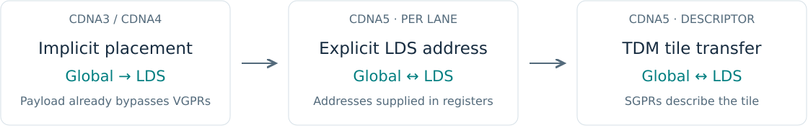
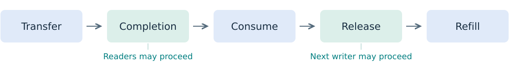

<!-- _class: compact -->

<div class="eyebrow">01 / Architecture · Programming CDNA5 / gfx1250</div>

# A new programming unit

| | CDNA3 · gfx942 | CDNA4 · gfx950 | CDNA5 · gfx1250 |
| :--- | :--- | :--- | :--- |
| Execution | Wave64 / CU | Wave64 / CU | **Wave32 / WGP** |
| LDS capacity | 64 KiB / CU | 160 KiB / CU | **320 KiB / WGP** |
| Matrix instructions | MFMA | MFMA | **WMMA** |
| Matrix registers | VGPR + AGPR | VGPR + AGPR | **One VGPR namespace** |


> Larger tiles fit. Keeping the matrix units supplied is the next problem.

<div class="source">CDNA4 whitepaper, p. 9 · CDNA5 whitepaper, pp. 6–10 · Capacity units are per CU or per WGP as labeled.</div>

<!--
3 min. Introduce the architecture half and the grouped-GEMM case study.
The WGP is the new comparison unit, not a renamed CDNA4 CU. Four SIMD32s share LDS.
Capacity and bandwidth are separate properties. Larger working sets can reduce resident waves.
Sources: https://www.amd.com/content/dam/amd/en/documents/instinct-tech-docs/white-papers/amd-cdna-4-architecture-whitepaper.pdf
https://www.amd.com/content/dam/amd/en/documents/products/technologies/cdna/amd-cdna5-whitepaper.pdf
-->

---

<div class="eyebrow">02 / Registers and matrix programming</div>

# More addressable VGPRs for one wave

- Up to **1024 VGPRs per thread**, including matrix accumulators.
- `S_SET_VGPR_MSB` supplies index bits 9:8 for each operand class.
- Low index 7 + MSB value 2 selects **v519**; settings persist.

<div class="registers">
<div>MSB 0<br>v0–v255</div>
<div>MSB 1<br>v256–v511</div>
<div class="selected">MSB 2<br>v512–v767</div>
<div>MSB 3<br>v768–v1023</div>
</div>

<div class="flow">LDS → VGPR operands → WMMA → VGPR accumulator</div>

<div class="placeholder"><div class="label">ASM placeholder · register selection + FP16 WMMA</div><p>Insert a short generated excerpt showing MSB changes and the 16 × 16 × 32 matrix instruction.</p></div>

<div class="source">CDNA5 ISA §§3.3.2, 7.12, 15.5 · More addressability does not imply four times the physical register capacity.</div>

<!--
3 min. The source/destination classes have independent MSB fields; this is not four independent register files.
Kernel instruction to show later: v_wmma_f32_16x16x32_f16, with FP16 A/B and FP32 accumulation.
All 32 lanes cooperate on one matrix operation. Mention ds_load_tr redistribution as an LDS-to-register option.
TODO ASM-REGISTERS: replace the box with generated assembly from the selected presentation build.
Source: CDNA5 ISA, 27 July 2026, §§3.3.2, 7.12, 15.5.
-->

---

<div class="eyebrow">03 / Data movement</div>

# Move payloads directly between memory and LDS



<div class="cols">
<div class="panel"><h3>Per-lane asynchronous transfers</h3><p>Programmable LDS addresses.</p><p>Global → LDS and LDS → global.</p><p class="small muted">Addresses still use registers.</p></div>
<div class="panel"><h3>Tensor Data Mover · TDM</h3><p>SGPR descriptors define 1–5D tiles.</p><p>Load / store; 2D gather / scatter.</p><p class="small muted">Loads support padding and multicast.</p></div>
</div>

> The payload bypasses VGPRs; addresses and descriptors still cost resources.

<div class="source">CDNA5 ISA §§10.8, 10.11 · Direct-to-LDS loading already exists on CDNA3/4.</div>

<!--
2 min. Explain the progression from implicit lane placement to explicit addresses to a tensor descriptor.
TDM operations are not per-lane operations and ignore EXEC; the source-level wave masks choose issuing waves.
TDM descriptors support both directions. Stores do not remove LDS padding.
Gather/scatter details are in backup E.
-->

---

<div class="eyebrow">04 / Synchronization</div>

# A buffer has two handoffs



<div class="cols">
<div class="panel"><h3>Completion is per wave</h3><p>TDM loads and stores complete in issue order within one wave.</p><p class="small">With two stores pending, wait-to-one retires the older store.</p></div>
<div class="panel"><h3>Sharing needs synchronization</h3><p>Other waves need a handoff; multicast extends it across workgroups.</p><p class="small">Mixed ASYNC loads/stores can complete out of order.</p></div>
</div>

> Transfer complete before read. All readers complete before refill.

<div class="source">CDNA5 ISA §§5.6–5.7, 10.8, 10.11.1, 11.2.2 · Compiler scheduling barriers do not synchronize workgroups.</div>

<!--
2 min. CDNA5 separates LOAD, STORE, DS, KM, ASYNC and TENSOR waits; counter details are backup A.
For the example, one wave issues C0 then C1. TDM completion ordering makes wait-to-one sufficient for C0.
This does not imply ordering across waves or against other memory types.
Split/named barriers separate arrival and wait. LDS asynchronous barriers can receive completion signals.
-->

---

<div class="eyebrow">05 / Scheduling</div>

# Two controls, different jobs

<div class="cols">
<div class="panel"><h3>Expert mode · bits [1:0] = 2</h3><p>Compiler waits resolve selected VMEM / VALU hazards.</p><p class="small"><code>VA_VDST</code> and <code>VM_VSRC</code><br>Enabled by this backend by default.</p></div>
<div class="panel"><h3>WMMA queuing · bit [2] = 1</h3><p>Queue WMMAs, then issue independent work.</p><p class="small">Useful here: one wave per SIMD.<br>WMMA hazard spacing still applies.</p></div>
</div>

<div class="placeholder"><div class="label">ASM placeholder · dependency waits and queued WMMA</div><p>Address producer → dependency wait → memory operation</p><p>Queued matrix work → independent scalar / memory instructions</p></div>

<div class="source">CDNA5 ISA §§5.7.2, 7.12.1 · LLVM SIInsertWaitcnts · third_party/amd/backend/compiler.py</div>

<!--
2 min. TRITON_HIP_USE_EXPERT_SCHEDULING controls the backend default.
Normal VALU-to-VALU dependencies still receive hardware handling; WMMA co-execution adds specific RAW/WAR/WAW spacing rules.
The TLX call amd_set_wave_sched_mode(1, offset=2, width=1) sets only bit 2; it does not enable LLVM wait insertion.
TODO ASM-SCHEDULING: generated excerpt showing both independent controls and the waits that protect reuse.
Sources: https://llvm.org/docs/doxygen/SIInsertWaitcnts_8cpp_source.html
CDNA5 ISA §§5.7.2, 7.12.1. Backup B has the WMMA hazard example.
-->

---

<div class="eyebrow">06 / Case study · TLX grouped GEMM</div>

# One persistent launch, many GEMMs

<div class="equation">C<sub>g</sub> = A<sub>g</sub> × B<sub>g</sub><sup>T</sup></div>

<div class="cols">
<div>

```text
A  [sum(Mg), K]
B  [G, N, K]
C  [sum(Mg), N]
group_offsets [G + 1]
```

<p class="small">FP16 input/output · FP32 accumulation<br>Both inputs are K-contiguous.</p>
</div>
<div class="panel"><h3>Working configuration</h3><p>Tile: <strong>256 × 256 × 128</strong></p><p>Four Wave32 waves</p><p><code>GROUP_M = 4</code>: vary M first to reuse B.</p><p class="small">Full tiles; group M sizes may differ.</p></div>
</div>

<div class="flow">Program p: tile p → tile p + P → tile p + 2P → …</div>

<div class="source">Code reference: b266fe4c1d · amd_grouped_gemm_gfx1250_test.py · Pointer-table baseline also supports masked ragged shapes.</div>

<!--
2 min. P is the persistent program count, not the number of output tiles.
Group offsets locate rows of packed A and C; B has a separate dense weight tensor per group.
The optimized path requires exact tile coverage. The pointer-table baseline supports different M/N/K with masks.
Continue the program's linear tile sequence across group ranges.
Source: third_party/tlx/tutorials/amd_grouped_gemm_gfx1250/amd_grouped_gemm_gfx1250_test.py
-->

---

<div class="eyebrow">07 / Supply the matrix units</div>

# Pipeline operands, bound their lifetimes


- **Two A slots + two B slots**; producer selects iteration modulo 2.
- Load the next K32 operand subtile before the current dot.
- Fused-load wave masks: **A = 0011**, **B = 1100**.
- Bound dot regions with `amd_sched_barrier()`; retain load/dot overlap.

<div class="placeholder small"><div class="label">ASM placeholder · steady K loop</div><p>Show interleaved LDS loads and WMMAs, plus operand lifetime boundaries.</p></div>

<div class="source">cafe4379f3 · f66d3fc00c · Wave masks select issuing waves; they are separate from multicast recipient masks.</div>

<!--
2 min. Each K128 block becomes four K32 tl.dot steps, each expanded to multiple WMMA instructions.
The diagram is a dependency schematic, not a cycle-accurate schedule.
Keep output descriptor updates in the epilogue to avoid extra VGPR-MSB transitions in the steady loop.
The source-level scheduling barrier constrains scheduling; it is not a workgroup synchronization barrier.
TODO ASM-PIPELINE: show generated instructions after validating the chosen configuration.
-->

---

<div class="eyebrow">08 / Cross tile boundaries</div>

# Use the tail to prime the next tile


<div class="cols">
<div class="panel"><h3>Hybrid · within one group</h3><p>Peel the final two K iterations.</p><p>Refill released slots with the next tile's K0 / K1.</p><p class="small">First tile in each group still needs priming.</p></div>
<div class="panel"><h3>Separate cross-group path</h3><p>Carry four upcoming boundaries.</p><p>Skip empty groups; refill metadata in the preceding tile's tail.</p><p class="small">Vector output stores preserve the input rings.</p></div>
</div>

<p class="small">Depth 2 · even K / 128 · at least two K blocks</p>

<div class="source">a050699ba1 · 42925e81b1 · M=2048, N=1024, P=32: one tile/program/group; M=4096: two.</div>

<!--
3 min. The tail recycles a slot only after current-tile operands have been read into registers.
The production hybrid does not prefetch across group boundaries. Do not attribute the cross-group schedule to it.
At one tile/program/group, within-group prefetch has no following tile to target.
The source option dedicated_c_buffer selects the square cross-group path, but its output uses vector stores.
-->

---

<div class="eyebrow">09 / Overlap output stores</div>

# Stage C in two small slots


- Split C into **eight 32-row chunks**; convert and store one at a time.
- Before reusing a slot, retire its older TDM store.
- The newest store may stay in flight; final stores overlap next-tile entry.

> TDM ordering protects the store queue; synchronization protects shared reuse.

<div class="source">7a58d5e627 · Sizes are logical payload, before layout overhead · ASM/resource allocation excerpt: placeholder.</div>

<!--
2 min. A and B rings use 2 × (256×128 + 256×128) × 2 bytes = 256 KiB.
Full C uses 256×256×2 = 128 KiB; two 32×256 FP16 slots use 32 KiB.
Alias-C reuses A storage but blocks A refill until the C store drains.
Here, TDM's per-wave completion order makes a partial wait useful. Other waves still require synchronization.
TODO ASM-OUTPUT: insert a compact excerpt or annotated detail showing slot reuse and partial waits.
TODO RESOURCE: verify actual LDS allocation and VGPR counts for the presentation build. Payload is not allocation.
-->

---

<div class="eyebrow">10 / Reuse data across workgroups</div>

# A 2 × 2 sharing pattern

<div class="cols">
<div></div>
<div>

| Operand | Recipient masks |
| :--- | :--- |
| A | `0101` / `1010` |
| B | `0011` / `1100` |

- Each transfer has **two recipients**.
- Every recipient issues a matching request.
- Before refill: local readers finish, then cluster arrival / wait.

</div>
</div>

<p class="small">Physical IDs 0,1,2,3 → logical IDs 0,2,4,6 → tiles (0,0), (2,0), (0,1), (2,1).</p>

<div class="source">acae400635 · f676cb6304 · GROUP_M=4; chunked remapping uses eight logical XCDs and chunk size two.</div>

<!--
3 min. The diagram is logical tile space, not physical GPU placement. The M rows are nonadjacent.
The physical rank is the mask bit position: rank 0 is the least significant bit.
Two-workgroup clusters share B only; four-workgroup clusters share A and B.
Masks select recipients independently of the source wave masks on slide 7.
Use the cluster constraints in backup G; ragged groups use ordinary workgroups.
-->

---

<!-- _class: efficiency -->

<div class="eyebrow">11 / XDL efficiency</div>

# What does each step recover?

<p class="subtitle">Full-kernel matrix capacity used · same workload and normalization</p>

| Variant | XDL efficiency | Δ vs. alias-C |
| :--- | :---: | :---: |
| Alias-C | TBD % | — |
| Hybrid | TBD % | TBD pp |
| Hybrid + remap | TBD % | TBD pp |
| + cluster, multicast off | TBD % | TBD pp |
| + multicast | TBD % | TBD pp |

<p class="small"><strong>Draft placeholders.</strong> Reference: G=16, M=4096, N=4096, K=4096; P=TBD.<br>Compare multicast on/off at the same cluster size. Keep steady-loop efficiency separate.</p>

<div class="source">Full-kernel scope includes startup, output stores, and tile/group transitions. pp = percentage points.</div>

<!--
3 min. No bars are drawn until the controlled results are available: lengths must not imply invented values.
TODO XDL-RESULTS: fill five percentages and percentage-point deltas from a matching workload/program-count comparison.
Choose and fix P across all variants. Cluster constraints require P divisible by 16 and dividing per-group tiles.
Define efficiency as the fraction of available matrix-execution capacity used across the full kernel.
Use the same observation scope and execution-unit normalization. Check correctness against torch.matmul.
Other possible cases: G=8/32 large groups, or ordinary GEMM cubes 4096/8192/16384.
-->

---

<!-- _class: questions -->

<div class="eyebrow">12 / Discussion</div>

# Where is the next gap?

<div class="panel"><span class="number">01</span>Matrix issue, LDS delivery, global traffic,<br>&nbsp;&nbsp;&nbsp;&nbsp;&nbsp;or tile-boundary overhead?</div>

<div class="panel"><span class="number">02</span>Which controlled comparison explains<br>&nbsp;&nbsp;&nbsp;&nbsp;&nbsp;the XDL efficiency change?</div>

<div class="flow">Data movement → buffer lifetime → instruction overlap → reuse</div>

<!--
3 min. Questions. The following eight slides are backup, outside the 30-minute main sequence.
Code reference b266fe4c1d. Chained-dot compiler changes reverted by 02a632587a are excluded from the story.
-->

---

<!-- _class: compact -->

<div class="eyebrow">Backup A / Wait counters</div>

# Partial waits need an ordering guarantee

| Counter | Tracks | Width |
| :--- | :--- | :--- |
| LOAD / STORE | Vector memory loads / stores | 6 bits |
| DS | LDS and the LDS portion of flat operations | 6 bits |
| KM | Scalar memory and messages | 5 bits |
| ASYNC | Direct asynchronous LDS transfers | 6 bits |
| TENSOR | TDM loads and stores | 6 bits |

- Wait-to-N means the issuing wave's counter is at most N; zero drains it.
- TDM load/store completion is ordered within a wave. Mixed ASYNC is not.
- Scalar loads can complete out of order: use a zero KM wait.
- Combined LOAD+DS / STORE+DS waits remain; XCNT tracks translations.

<div class="source">CDNA5 ISA §§5.7, 10.8, 10.11.1 · Hardware stalls issue before counter overflow.</div>

<!--
6-bit range: 0–63; 5-bit range: 0–31. Counts are not cycles or lanes.
Scalar memory increments KM by 1 for one DWORD, by 2 for larger loads.
ASYNC loads complete in order with loads, and stores with stores; mixed directions are not ordered.
XCNT does not establish completed payload transfers.
-->

---

<div class="eyebrow">Backup B / WMMA co-execution hazards</div>

# Dependency waits are only part of the contract

- Multicycle instructions can co-execute within a wave.
- Hardware does not detect every overlapping-operand hazard.
- Code generation must satisfy the ISA's **RAW / WAR / WAW** spacing rules.

<div class="placeholder"><div class="label">ASM placeholder · FP16 WMMA → dependent VALU</div><p>Show a VALU reading the preceding WMMA's Matrix D, with the required independent instructions or V_NOPs between them.</p></div>

<p class="small">For this case: four independent VALU instructions or V_NOPs with co-execution enabled; none required with co-execution disabled.</p>

> Required spacing depends on the instruction and operand overlap.

<div class="source">CDNA5 ISA §§5.7.2, 7.12.1 · SCHED_MODE[2] permits queuing; it does not waive hazard rules.</div>

<!--
TODO ASM-HAZARDS. RAW=read after write; WAR=write after read; WAW=write after write.
A WMMA result reused as a following WMMA input has a different requirement. Use the full ISA table.
The instruction count here is an architectural hazard requirement, not a measured performance result.
-->

---

<div class="eyebrow">Backup C / LDS conflicts</div>

# Bank conflicts and partition conflicts differ

<div class="cols">
<div class="panel"><h3>Within a wave: banks</h3><p>64 banks, 4 bytes each.</p><p><code>bank = (address &gt;&gt; 2) &amp; 63</code></p><p class="small">4 × lane: distinct banks.<br>256 × lane: distinct words in bank 0.</p></div>
<div class="panel"><h3>Across SIMD pairs: partitions</h3><p>Five physical 64 KiB LDS regions.</p><p>Pairs {0,2} and {1,3} contend when they access one partition together.</p><p class="small">Bank-conflict freedom alone is insufficient.</p></div>
</div>

| Opposite-pair wave reads | Banks | Physical partition |
| :--- | :--- | :--- |
| [0,128) and [256,384) | Distinct within each wave | Same |
| [0,128) and 65536+[0,128) | Distinct within each wave | Different |

<div class="source">CDNA5 ISA §11.1 · AMD “Understanding LDS on MI450” article · Addresses include the physical allocation base.</div>

<!--
The ranges show B32 reads by Wave32. Each wave's lanes have distinct banks.
Two 256-byte/cycle ports can reach 512 bytes/cycle with different partitions; this is an architectural limit.
Fix bank mapping through padding/swizzling; partition mapping through pair-aware layouts and allocation.
Analyze ds_load_tr source addresses before redistribution.
Source: https://rocm.blogs.amd.com/software-tools-optimization/mi450-lds-optimization/README.html
-->

---

<div class="eyebrow">Backup D / Instruction clauses</div>

# S_CLAUSE groups a supported memory class

- One wave receives an uninterrupted sequence for the selected class.
- Supported: non-flat memory, flat memory, indexed LDS, or SMEM.
- The first instruction selects the class; stalled clauses can leave units idle.

<div class="placeholder"><div class="label">ASM placeholder · one memory clause</div><p>Show a clause covering four compatible memory instructions; annotate the count-minus-one length field.</p></div>

> TDM instructions are illegal inside a clause.

<p class="small">A clause neither waits for memory completion nor synchronizes workgroups.</p>

<div class="source">CDNA5 ISA §§5.3, 10.11.1, 15.5 · Do not mix clause classes or nest clauses.</div>

<!--
TODO ASM-CLAUSE: use a supported non-TDM sequence. Non-flat includes buffer/global/scratch/ASYNC.
S_CLAUSE length encodes count minus one. Put waits required by the first instruction before the clause.
Some scalar housekeeping instructions are legal after the first instruction; refer to the ISA table.
-->

---

<div class="eyebrow">Backup E / TDM gather and scatter</div>

# Select rows with descriptor indices

| Direction | Operation | Index list per instruction |
| :--- | :--- | :--- |
| Global → LDS | Gather rows | 16 × 16-bit or 8 × 32-bit |
| LDS → global | Scatter rows | 16 × 16-bit or 8 × 32-bit |

- Gather/scatter mode is restricted to **2D tiles**.
- Gather indices may be arbitrary or repeated.
- Correct out-of-bounds handling requires **nondecreasing indices**.
- Issue more instructions for more rows.

> Padding and multicast apply to loads. Stores do not remove LDS padding.

<div class="source">CDNA5 ISA §10.11.3 · Descriptor groups 2 and 3 carry the row indices.</div>

<!--
Gather indices generate global row addresses. The store direction uses the indices to scatter from LDS.
Keep the OOB qualification: arbitrary ordering is allowed, but does not guarantee correct OOB handling.
-->

---

<div class="eyebrow">Backup F / Precision</div>

# Scaling is another programming dimension

<div class="cols">
<div class="panel"><h3>CDNA4</h3><p>FP4 / FP6 support</p><p>OCP microscaling</p></div>
<div class="panel"><h3>CDNA5</h3><p>16- and 32-element scale blocks</p><p>Fractional FP4 scales</p></div>
</div>

- Tile formats and scale layout affect the data path.
- This case study uses **FP16 operands and output, FP32 accumulation**.
- Keep that precision fixed across the XDL efficiency comparison.

<div class="source">AMD architecture comparison · CDNA5 ISA §7.12.6 · No peak-throughput comparison in this deck.</div>

<!--
This is format context, not a low-precision optimization claim for the FP16 grouped-GEMM kernel.
Source: https://www.amd.com/en/technologies/cdna.html
-->

---

<!-- _class: compact cluster -->

<div class="eyebrow">Backup G / Cluster contract</div>

# Keep cluster members on matching boundaries

| Setting | Required by this kernel |
| :--- | :--- |
| Tile / ring / ordering | 256 × 256 × 128 / depth 2 / GROUP_M=4 |
| Path | Within-group hybrid; cross-tile prefetch enabled |
| Remapping | Chunked; eight logical XCDs; chunk size two |
| Group shapes | Equal positive M; M divisible by 1024; N divisible by 512 |
| Program count P | Divisible by 16; divides each group's output tile count |
| Other options | L2 prefetch off; dedicated C off; auto configuration off |

<p><code>ctas_per_cga=(cluster_size, 1, 1)</code></p>

- Grid and P count physical workgroups; one output tile per workgroup.
- Native fused-load masks + `tlx.cluster_barrier()` protect refills.
- Benchmark default: four-workgroup clusters. General wrapper: one.

<div class="source">f676cb6304 · b266fe4c1d · README and API tests for amd_grouped_gemm_gfx1250.</div>

<!--
These are implementation constraints, not general ISA restrictions on clusters.
General ragged groups use ordinary workgroups. Explicit multicast masks are independent of tensor distribution.
Each selected recipient issues the same request at the same LDS offset.
Source: python/test/unit/language/test_tlx_amd_gfx1250.py
-->

---

<div class="eyebrow">Backup H / Small M and resource budget</div>

# Smaller tiles can expose more parallel work

| Logical payload | 256 × 256 × 128 hybrid | 128 × 256 × 128 |
| :--- | :--- | :--- |
| A/B rings, depth 2 | 256 KiB | 192 KiB |
| C staging | 32 KiB, chunked | 64 KiB, dedicated |
| Total before layout overhead | **288 KiB** | **256 KiB** |

- Finer M tiles increase available work for small groups.
- Asymmetric prefetch stays within a group; it needs tiles/group &gt; P.
- The square FP32 accumulator alone holds **512 values per thread**.

<div class="placeholder small"><div class="label">Resource placeholder · selected build</div><p>Insert verified LDS allocation and VGPR counts for both configurations.</p></div>

<div class="source">Kernel configuration guide · Auto selection ranks relative saturated rate × CU utilization × useful/padded FLOPs.</div>

<!--
The square tile has 256×256 FP32 values distributed across 128 threads: 512 values per thread.
Operands and addresses add register pressure. Payload arithmetic does not include physical layout overhead.
TODO RESOURCE: replace the placeholder after compiling the exact configurations.
-->
